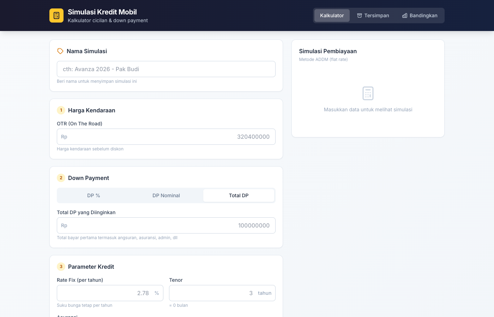

# Simulasi Kredit Mobil

Kalkulator simulasi kredit kendaraan berbasis web untuk menghitung cicilan, down payment, dan total biaya pembiayaan. Dibangun dengan React + TypeScript + Tailwind CSS.

## Pratinjau



## Fitur

### Kalkulator
- Hitung cicilan bulanan dengan metode ADDM (flat rate)
- 3 mode down payment: persentase, nominal, atau target total DP (reverse-calculate)
- 3 mode asuransi: % total dari OTR, % per tahun, atau nominal Rupiah
- Input fleksibel untuk rate fix, tenor, administrasi, credit life, TJH, dan capitalize on risk
- Ringkasan bayar pertama dan total uang keluar selama masa kredit

### Simpan & Kelola
- Simpan simulasi ke browser (localStorage) dengan nama
- Edit simulasi tersimpan atau simpan sebagai salinan baru
- Cari dan urutkan simulasi berdasarkan tanggal, nama, OTR, cicilan, total DP, atau total keluar
- Hapus simulasi dengan konfirmasi

### Perbandingan
- Bandingkan 2 atau lebih simulasi dalam satu tabel
- Edit parameter langsung di tabel perbandingan, hasil otomatis terhitung
- Label "Terbaik" pada nilai paling menguntungkan di setiap baris
- Ringkasan selisih antara 2 simulasi (cicilan, total DP, grand total)

## Tech Stack

- [React](https://react.dev/) 19
- [TypeScript](https://www.typescriptlang.org/)
- [Vite](https://vite.dev/) 6
- [Tailwind CSS](https://tailwindcss.com/) 3
- [React Router](https://reactrouter.com/) 7

## Getting Started

```bash
npm install
npm run dev
```

Buka `http://localhost:5173` di browser.

## Build

```bash
npm run build
npm run preview
```

Build untuk GitHub Pages (subpath `/nama-repo/`) memakai variabel lingkungan:

```bash
VITE_BASE_URL=/hitung-cicilan-mobil/ npm run build
```

Tanpa `VITE_BASE_URL`, aset dilayani dari root (`/`) — cocok untuk Vercel, Netlify, atau domain sendiri.

## Hosting

### GitHub Pages (otomatis)

Repositori ini menyertakan workflow [`.github/workflows/deploy-github-pages.yml`](.github/workflows/deploy-github-pages.yml) yang membangun situs dan menerbitkannya lewat GitHub Actions.

1. Di GitHub: **Settings → Pages → Build and deployment**, pilih sumber **GitHub Actions** (bukan branch `gh-pages` manual).
2. Push ke branch `master` atau `main`. Workflow **Deploy GitHub Pages** akan jalan dan mengunggah artefak `dist`.
3. Setelah selesai, aplikasi tersedia di `https://<username>.github.io/hitung-cicilan-mobil/`.

Jika nama repositori berubah, sesuaikan nilai `VITE_BASE_URL` di file workflow agar sama dengan subpath GitHub Pages Anda.

### Vercel atau Netlify

1. Hubungkan repositori GitHub ke [Vercel](https://vercel.com/) atau [Netlify](https://www.netlify.com/).
2. Framework preset: **Vite**. Perintah build: `npm run build`, folder keluaran: **`dist`**.
3. Jangan set `VITE_BASE_URL` di panel environment (biarkan kosong) agar routing dan aset memakai root domain proyek Anda.

## Struktur Halaman

| Path | Halaman | Keterangan |
|------|---------|------------|
| `/` | Kalkulator | Input parameter dan lihat hasil simulasi |
| `/saved` | Tersimpan | Daftar simulasi yang sudah disimpan |
| `/compare?ids=...` | Bandingkan | Perbandingan simulasi side-by-side |

## Rumus

**Cicilan (ADDM / flat rate):**

```
Plafon = (OTR - DP Murni) + Capitalize on Risk
Cicilan = Plafon × (1 + Rate × Tenor_tahun) / Tenor_bulan
```

**Reverse DP (dari total bayar pertama):**

```
K = (1 + Rate × Tahun) / Bulan
DP Murni = (Total - OTR×K - CoR×K - Asuransi - Admin - CreditLife - TJH) / (1 - K)
```

## Lisensi

MIT
